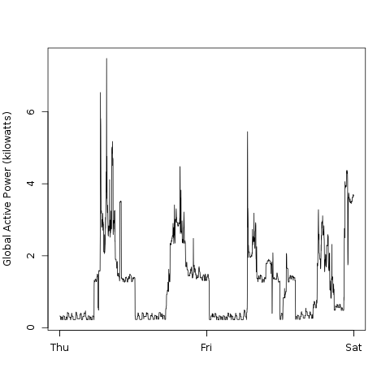
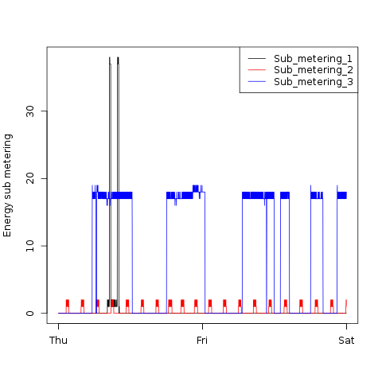

## Exploratory Data Analysis Course Project 1

This assignment is the first project of Coursera's Exploratory Data Analysis
course (Johns Hopkins University).
It uses data from the "Individual household
electric power consumption Data Set" (from
<a href="http://archive.ics.uci.edu/ml/">UC Irvine Machine
Learning Repository</a>).

A copy of the dataset is here:
<a href="https://d396qusza40orc.cloudfront.net/exdata%2Fdata%2Fhousehold_power_consumption.zip">Electric power consumption</a> [20Mb]

<b>Description</b>: Measurements of electric power consumption in
one household with a one-minute sampling rate over a period of almost
4 years. Different electrical quantities and some sub-metering values
are available.

The original dataset is composed of these fields:  
<ol>
<li><b>Date</b>: Date in format dd/mm/yyyy </li>
<li><b>Time</b>: time in format hh:mm:ss </li>
<li><b>Global_active_power</b>: household global minute-averaged active power (in kilowatt) </li>
<li><b>Global_reactive_power</b>: household global minute-averaged reactive power (in kilowatt) </li>
<li><b>Voltage</b>: minute-averaged voltage (in volt) </li>
<li><b>Global_intensity</b>: household global minute-averaged current intensity (in ampere) </li>
<li><b>Sub_metering_1</b>: energy sub-metering No. 1 (in watt-hour of active energy). It corresponds to the kitchen, containing mainly a dishwasher, an oven and a microwave (hot plates are not electric but gas powered). </li>
<li><b>Sub_metering_2</b>: energy sub-metering No. 2 (in watt-hour of active energy). It corresponds to the laundry room, containing a washing-machine, a tumble-drier, a refrigerator and a light. </li>
<li><b>Sub_metering_3</b>: energy sub-metering No. 3 (in watt-hour of active energy). It corresponds to an electric water-heater and an air-conditioner.</li>
</ol>

## Objectives of the project

The goal is to examine how household energy usage varies over a 2-day period (1-2 
January 2007) and to produce four .png plot files with four separate R scripts using the base plotting system.

## The project

In this repo you can find:

<ul>
<li><b>README.md</b>: this file </li> 
<li><b>download.R</b>: script wich download and unzip the dataset into the current directory</li>
<li><b>plot1.R</b>: script for the first plot </li>
<li><b>plot2.R</b>: script for the second plot  </li>
<li><b>plot3.R</b>: script for the third plot  </li>
<li><b>plot4.R</b>: script for the fourth plot </li>
<li><b>plot1.png</b>: output of the first script </li>
<li><b>plot2.png</b>: output of the second script </li>
<li><b>plot3.png</b>: output of the third script  </li>
<li><b>plot4.png</b>: output of the fourth script  </li>
</ul>

The script download.R download and unzip the dataset file.The other four
scripts all have the same structure:
a service function <b>read_dataset()</b> is defined, wich load the required data
from the dataset file (only the observations from the two days considered are loaded).
The Date and Time variables are converted to R date an Time.
The main function <b>plotX</b>(X=1,2,3,4) call read_dataset() and make the plot.

### plotX USAGE
* <b>plotX()</b>  load the data,make the plot to  plotX.png file;
* <b>plotX(FALSE)</b> or <b>plotX(FALSE)</b>  same as above, but plot to  screen;

## Results

Below are the original plot images given (on the left) and my plots (on the right)

### Plot 1

| Plot 1 given | my Plot 1 |
| ---------------- | -------------|
|  |  |

### Plot 2

<table border=1>
<tr>
<th>Plot 2 given</th>
<th>my Plot 2</th>
</tr>
<tr>
<td></td> 
<td></td>
</tr>
</table>
### Plot 3

<table border=1>
<tr>
<th>Plot 3 given</th>
<th>my Plot 3</th>
</tr>
<tr>
<td></td> 
<td></td>
</tr>
</table>

### Plot 4

<table border=1>
<tr>
<th>Plot 4 given</th>
<th>my Plot 4</th>
</tr>
<tr>
<td></td> 
<td></td>
</tr>
</table>

